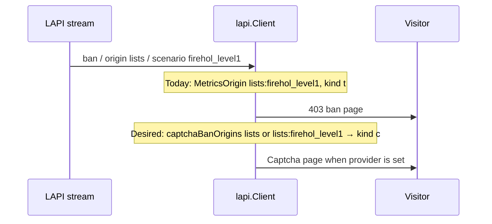

Developer review: ready for review — 2026-09-20T19:36:14Z

IssueKey: 2026-09-20-captcha-ban-origins
JobName: 2026-09-20-captcha-ban-origins

[sgsi-dev-ticket-status:2026-09-20-captcha-ban-origins]

## What this changes
**Operators.** Traefik list `captchaBanOrigins` (empty default) stores LAPI `ban` as captcha for matching metrics origins (`CAPI`, `lists`, or `lists:<name>`), adopted from upstream https://github.com/maxlerebourg/crowdsec-bouncer-traefik-plugin/pull/369 with per-list matching; unlisted origins stay ban, and a missing captcha provider still renders ban.

**Admin users.** None.

**Developers.** `lapi.Client.remediationKindForOrigin` remaps after `MetricsOrigin` on stream Ip/header Put, stream Range upsert, and live/none strongest pick; first `New` copy is residue (not on the Open key); spec `core_plugin_lapi_captcha-ban-origins` plus usage packet.

**End users.** Visitors whose address is a listed-origin ban see a captcha challenge instead of a 403 when a captcha provider is configured.

## Motivation
CrowdSec CAPI and console list decisions always arrive as type `ban`. Console and `profiles.yaml` cannot turn those into captcha, so a visitor whose address sits on a shared blocklist gets a hard 403.

On `master`, stream and live map `RemediationValue(decision.Type)` only. `MetricsOrigin` already rewrites list decisions to `lists:<scenario>` for metrics and stored origin, but that string does not change the kind letter. Upstream https://github.com/maxlerebourg/crowdsec-bouncer-traefik-plugin/pull/369 remaps on raw `decision.Origin`; this fork must match the rewritten string so `lists` and `lists:firehol_level1` can differ.

Without merge, operators cannot offer captcha for community or per-list bans.

## Merge readiness
Ready for review. 0 items remain.

Priority: P2 — real visitor 403s on shared blocklists with no captcha path until origin remap ships.
Reviewed head: da02bc1f
Owner decision: Required. See Decision needed.

## Review scores
| Measure | Result | What it means |
| --- | --- | --- |
| Overall readiness | 6 | Apply archived; required checks succeeded |
| CI proof | 6 | Head `da02bc1f` required checks succeeded |
| Local tests proof | N/A | Remote PR; CI covers proof |
| Review resolution | 6 | No open PR comments |

## Verification
| Check | Result | Evidence |
| --- | --- | --- |
| Branch | 2026-09-20-captcha-ban-origins pushed | `git` `da02bc1f` |
| OpenSpec | captcha-ban-origins (archived) | `openspec/changes/archive/2026-09-20-captcha-ban-origins/` |
| Pull request | https://github.com/david-garcia-garcia/crowdsec-bouncer-traefik-plugin/pull/130 | GitHub, base `master`, title `✨ feat(lapi): serve captcha for configured ban origins` |
| CI | build 35532575040 success https://github.com/david-garcia-garcia/crowdsec-bouncer-traefik-plugin/actions/runs/35532575040 ; build 35532575041 success https://github.com/david-garcia-garcia/crowdsec-bouncer-traefik-plugin/actions/runs/35532575041 | Main Process, Race detector, e2e mock/pester/dragonfly |
| Local tests | passed | handoff.yaml |
| PR comments | no comments | comments: none |

## Specs
- [core_plugin_lapi_captcha-ban-origins](https://github.com/david-garcia-garcia/crowdsec-bouncer-traefik-plugin/blob/2026-09-20-captcha-ban-origins/openspec/changes/archive/2026-09-20-captcha-ban-origins/proposal.md) — added

## Follow-up issues
None.

## How this fits together
Local ticket → branch `2026-09-20-captcha-ban-origins` on dest `master` → PR #130 → adopt upstream https://github.com/maxlerebourg/crowdsec-bouncer-traefik-plugin/pull/369 with `lists:<name>` matching on `MetricsOrigin`; OpenSpec change archived; required CI succeeded.

## Decision needed
| Question | Decision | By |
| --- | --- | --- |
| Should ValidateParams reject unknown origin tokens? | assumed — no; trim and ignore empty entries only | explore |
| Exact vs case-fold match for `CAPI` / `lists`? | assumed — exact equality on the metrics origin; `lists` also matches a `lists:` prefix | explore |
| Can two routers sharing one Client have different CaptchaBanOrigins? | assumed — no; first `New` wins; do not add the list to the Open key | explore |
| Does `lists` match a decision whose MetricsOrigin stayed `lists` (empty scenario)? | assumed — yes | explore |

## Before merge
None.

## Findings
None.

## Axis review
[Standards](https://github.com/david-garcia-garcia/crowdsec-bouncer-traefik-plugin/blob/2026-09-20-captcha-ban-origins/devstate/2026/09/2026-09-20-captcha-ban-origins/codereview_standards.md) — 0 total, 0 pending, 0 completed
[Spec](https://github.com/david-garcia-garcia/crowdsec-bouncer-traefik-plugin/blob/2026-09-20-captcha-ban-origins/devstate/2026/09/2026-09-20-captcha-ban-origins/codereview_spec.md) — 0 total, 0 pending, 0 completed
[Security](https://github.com/david-garcia-garcia/crowdsec-bouncer-traefik-plugin/blob/2026-09-20-captcha-ban-origins/devstate/2026/09/2026-09-20-captcha-ban-origins/codereview_security.md) — 0 total, 0 pending, 0 completed
[Performance](https://github.com/david-garcia-garcia/crowdsec-bouncer-traefik-plugin/blob/2026-09-20-captcha-ban-origins/devstate/2026/09/2026-09-20-captcha-ban-origins/codereview_performance.md) — 0 total, 0 pending, 0 completed
[Dead](https://github.com/david-garcia-garcia/crowdsec-bouncer-traefik-plugin/blob/2026-09-20-captcha-ban-origins/devstate/2026/09/2026-09-20-captcha-ban-origins/codereview_dead.md) — 0 total, 0 pending, 0 completed
[Test coverage](https://github.com/david-garcia-garcia/crowdsec-bouncer-traefik-plugin/blob/2026-09-20-captcha-ban-origins/devstate/2026/09/2026-09-20-captcha-ban-origins/codereview_coverage.md) — 3 total, 0 pending, 2 completed, 1 skipped

## Agent review details

### Review metrics
| Metric | Value | Why it matters |
| --- | --- | --- |
| Specs in this PR | 1 added / 0 modified | Same list as ## Specs |
| Open reviewer comments walked | 0 FIX / 0 ANSWER / 0 open | Unanswered review is merge risk |
| Reviewed head | da02bc1fea21bb9c44cb4e710a29f95f118ca7db | Card matches the branch you measured |

### Stored data model
- Changed: decision store Ip/header slot / kind letter — string — sample `t` → `c` when a listed metrics origin remaps a `ban`. Upgrade: rewritten on next stream or live write.
- Changed: decision store Range upsert / kind letter — string — sample `t` → `c` on the same match. Upgrade: rewritten on next stream write.

### Technical review
Best possible solution: remap at store/query using `MetricsOrigin` plus one Client helper, matching upstream #369 live+stream scope with per-list matching this fork already has the origin string for.

Do we have a high-confidence way to reproduce? Yes, unit tests in `pkg/lapi/zzz_captcha_ban_origins_test.go` and e2e `tests/e2e/mock/scenarios/captcha-ban-origins/`.

Is this the best way to solve the issue? Yes versus DestBranch: ServeHTTP remap would break live strongest-pick and Range ban-over-captcha; raw `origin` match cannot distinguish lists.

### Evidence
What I checked:
- Product apply on `origin/master...HEAD` (`da02bc1f`, git)
- Archive path `openspec/changes/archive/2026-09-20-captcha-ban-origins/` and live spec `openspec/specs/core_plugin_lapi_captcha-ban-origins/spec.md`
- Coverage axis Range + live lookup tests (`codereview_coverage.md`)
- CI check runs on PR #130 head `da02bc1f`: Main Process, Race detector, e2e mock/pester/dragonfly all success (GitHub `get_check_runs`)

### Rank-up moves
- Unit test that a second reclaim `New` keeps the first `CaptchaBanOrigins` copy
