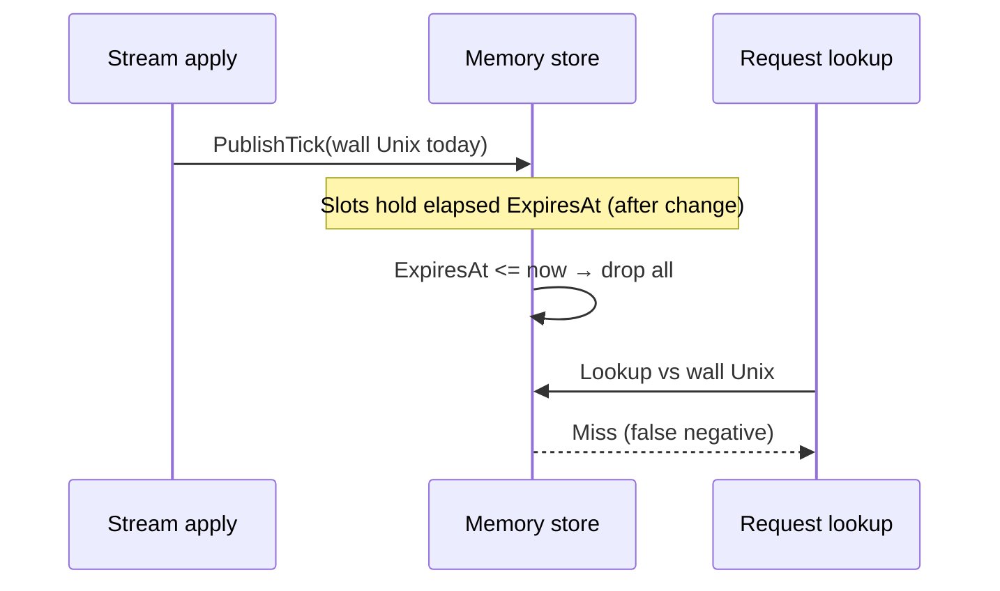

Developer review: in progress — 2026-09-20T06:13:30Z

IssueKey: 2026-09-20-elapsedsec-liveslot
JobName: 2026-09-20-elapsedsec-liveslot

[sgsi-dev-ticket-status:2026-09-20-elapsedsec-liveslot]

## What this changes
**Operators.** None.

**Admin users.** None.

**Developers.** Versus `master`, memory `LiveSlot` is `{uint32,int32}` with elapsed-second `ExpiresAt`, package-init clock and `ElapsedNow()` in `pkg/decisionstore`, and `PublishTick(int32)` from stream apply and memory sweeps; devdocs now document the elapsed slot clock and stream-apply defer; Redis TTL paths unchanged.

**End users.** None.

## Motivation
Large memory-backed decision maps store one 16-byte `LiveSlot` per IP or header key because `ExpiresAt` is an int64 Unix second beside a uint32 word. At roughly one million IPv4 entries that padding and width show up as tens of megabytes per published map and again while a stream tick clones the map before publish.

On `master` (DestBranch), expiry is computed with wall Unix everywhere: packing a slot, sweeping on publish, live copy-on-write puts, and request-path lookup all mix `time.Now().Unix()` with the stored timestamp. The ticket keeps that predicate shape but moves both stored expiry and the `now` argument to a process-local elapsed-second clock so slots shrink to eight bytes without treating the int32 field as Unix time.

If we ship elapsed slots but leave callers passing wall Unix into `PublishTick` or lookup, every slot would look expired on the next stream apply — a silent total loss of in-memory bans.

## Merge readiness
Devdocs-impact complete; archive and pullrequest phases remain. CI not yet measured on latest push.

Priority: P3 — internal memory layout and correctness; no current operator or end-user harm once merged.
Reviewed head: 4763ed3a
Owner decision: None.

## Review scores
| Measure | Result | What it means |
| --- | --- | --- |
| Overall readiness | 3 | Local tests passed; CI not seen on 4763ed3a |
| CI proof | 1 | Pushed; check status not seen on PR #121 |
| Local tests proof | N/A | Remote PR |
| Review resolution | 6 | No PR review comments |

## Verification
| Check | Result | Evidence |
| --- | --- | --- |
| Branch | 2026-09-20-elapsedsec-liveslot pushed | origin tracking |
| OpenSpec | compact-liveslot-elapsedsec (live) | openspec/changes/compact-liveslot-elapsedsec |
| Pull request | https://github.com/david-garcia-garcia/crowdsec-bouncer-traefik-plugin/pull/121 | GitHub |
| CI | not seen | PR checks |
| Local tests | passed | handoff.yaml |
| PR comments | no comments | comments: none |

## Specs

- [core_plugin_decisionstore_store](https://github.com/david-garcia-garcia/crowdsec-bouncer-traefik-plugin/blob/2026-09-20-elapsedsec-liveslot/openspec/changes/compact-liveslot-elapsedsec/proposal.md) — modified

## Follow-up issues
None.

## How this fits together
Local ticket → PR #121 → devdocs updated for DecisionStore and stream apply → archive next.

## Decision needed
None.

## Before merge
- [x] [P3] Devdocs-impact (elapsed clock Language + stream-apply snippet)
- [ ] [P3] OpenSpec archive and pullrequest phases
- [ ] [P3] CI green on PR #121

## Findings
None.

## Axis review
[Standards](https://github.com/david-garcia-garcia/crowdsec-bouncer-traefik-plugin/blob/2026-09-20-elapsedsec-liveslot/devstate/2026/09/2026-09-20-elapsedsec-liveslot/codereview_standards.md) — 7 total, 0 pending, 6 completed, 1 skipped
[Spec](https://github.com/david-garcia-garcia/crowdsec-bouncer-traefik-plugin/blob/2026-09-20-elapsedsec-liveslot/devstate/2026/09/2026-09-20-elapsedsec-liveslot/codereview_spec.md) — 1 total, 0 pending, 1 completed
[Security](https://github.com/david-garcia-garcia/crowdsec-bouncer-traefik-plugin/blob/2026-09-20-elapsedsec-liveslot/devstate/2026/09/2026-09-20-elapsedsec-liveslot/codereview_security.md) — 0 total, 0 pending, 0 completed
[Performance](https://github.com/david-garcia-garcia/crowdsec-bouncer-traefik-plugin/blob/2026-09-20-elapsedsec-liveslot/devstate/2026/09/2026-09-20-elapsedsec-liveslot/codereview_performance.md) — 0 total, 0 pending, 0 completed
[Dead](https://github.com/david-garcia-garcia/crowdsec-bouncer-traefik-plugin/blob/2026-09-20-elapsedsec-liveslot/devstate/2026/09/2026-09-20-elapsedsec-liveslot/codereview_dead.md) — 0 total, 0 pending, 0 completed
[Test coverage](https://github.com/david-garcia-garcia/crowdsec-bouncer-traefik-plugin/blob/2026-09-20-elapsedsec-liveslot/devstate/2026/09/2026-09-20-elapsedsec-liveslot/codereview_coverage.md) — 2 total, 0 pending, 2 completed

## Agent review details

### Review metrics
| Metric | Value | Why it matters |
| --- | --- | --- |
| Specs in this PR | 0 added / 1 modified | Fold into decisionstore store leaf |
| Open reviewer comments walked | 0 FIX / 0 ANSWER / 0 open | comments: none |
| Reviewed head | 4763ed3a | Pin origin/master...HEAD excluding devstate |

### Stored data model
- Changed: memory map value `LiveSlot` / field `ExpiresAt` — int32 elapsed seconds — sample wall Unix int64 on master → elapsed since package origin. Upgrade: rewritten on next stream or live Put; in-memory only.

### Technical review
Best possible solution: Elapsed int32 slots with one package clock and int32 PublishTick matches explore and requirement versus `master` int64 wall encoding.

Do we have a high-confidence way to reproduce? Yes — decisionstore memory expiry tests and stream apply wiring.

Is this the best way to solve the issue? Yes — eight-byte slots without a second package; Redis wall TTL stays separate.

### Evidence
What I checked:
- `devdocs-impact.md` three stale/language findings produced
- Updated `core_plugin_decisionstore.md` and `core_plugin_lapi_stream-apply.md`

### Rank-up moves
None.
