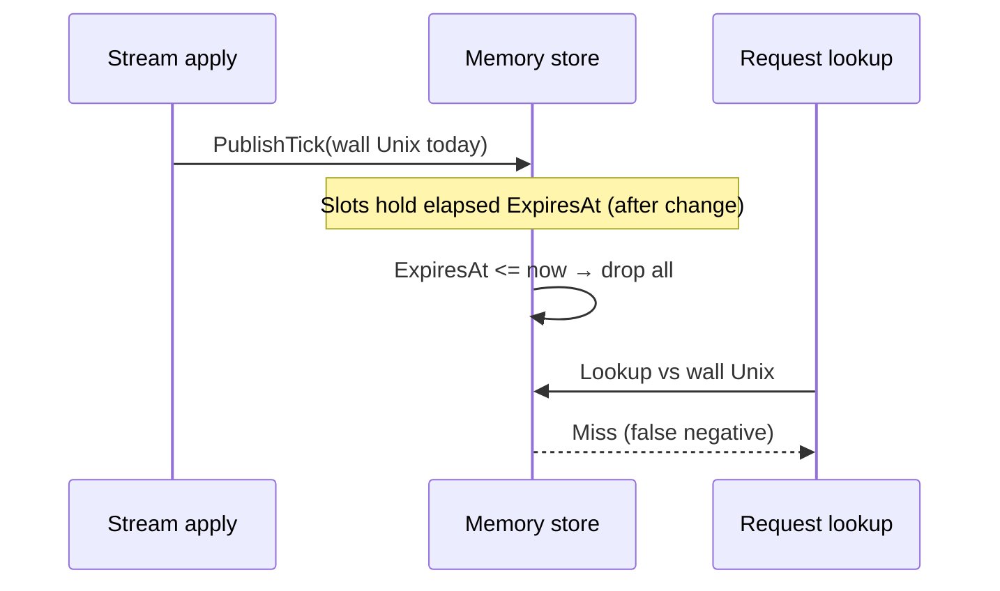

Developer review: in progress — 2026-09-20T06:06:30Z

IssueKey: 2026-09-20-elapsedsec-liveslot
JobName: 2026-09-20-elapsedsec-liveslot

[sgsi-dev-ticket-status:2026-09-20-elapsedsec-liveslot]

## What this changes
**Operators.** None.

**Admin users.** None.

**Developers.** Versus `master`, memory `LiveSlot` is `{uint32,int32}` with elapsed-second `ExpiresAt`, package-init clock and `ElapsedNow()` in `pkg/decisionstore`, and `PublishTick(int32)` from stream apply and memory sweeps; Redis TTL paths unchanged.

**End users.** None.

## Motivation
Large memory-backed decision maps store one 16-byte `LiveSlot` per IP or header key because `ExpiresAt` is an int64 Unix second beside a uint32 word. At roughly one million IPv4 entries that padding and width show up as tens of megabytes per published map and again while a stream tick clones the map before publish.

On `master` (DestBranch), expiry is computed with wall Unix everywhere: packing a slot, sweeping on publish, live copy-on-write puts, and request-path lookup all mix `time.Now().Unix()` with the stored timestamp. The ticket keeps that predicate shape but moves both stored expiry and the `now` argument to a process-local elapsed-second clock so slots shrink to eight bytes without treating the int32 field as Unix time.

If we ship elapsed slots but leave callers passing wall Unix into `PublishTick` or lookup, every slot would look expired on the next stream apply — a silent total loss of in-memory bans.

## Merge readiness
Implement complete; CI still running on reviewed head. 4 workflow phases remain after implement.

Priority: P3 — internal memory layout and correctness; no current operator or end-user harm once merged.
Reviewed head: ac0641fc
Owner decision: None.

## Review scores
| Measure | Result | What it means |
| --- | --- | --- |
| Overall readiness | 3 | Local tests passed; CI in progress |
| CI proof | 3 | Workflow run in progress — https://github.com/david-garcia-garcia/crowdsec-bouncer-traefik-plugin/actions/runs/35493309623 |
| Local tests proof | 6 | `go test ./pkg/decisionstore/... ./pkg/lapi/...` passed |
| Review resolution | N/A | No PR review comments inventoried |

## Verification
| Check | Result | Evidence |
| --- | --- | --- |
| Branch | 2026-09-20-elapsedsec-liveslot pushed | origin tracking |
| DestBranch | master | handoff.yaml |
| OpenSpec | compact-liveslot-elapsedsec (tasks complete) | openspec/changes/compact-liveslot-elapsedsec |
| Pull request | https://github.com/david-garcia-garcia/crowdsec-bouncer-traefik-plugin/pull/121 | GitHub (base: master) |
| CI | build 35493309623 in progress https://github.com/david-garcia-garcia/crowdsec-bouncer-traefik-plugin/actions/runs/35493309623 | GitHub check runs (Main Process queued, Race detector in progress) |
| Local tests | passed | handoff.yaml |
| PR comments | no comments | comments.md absent |

## Specs

- [core_plugin_decisionstore_store](https://github.com/david-garcia-garcia/crowdsec-bouncer-traefik-plugin/blob/2026-09-20-elapsedsec-liveslot/openspec/changes/compact-liveslot-elapsedsec/proposal.md) — modified

## Follow-up issues
None.

## How this fits together
Local ticket → branch from `origin/master` → PR #121 → OpenSpec apply at ac0641fc → codereview next after CI.

## Decision needed
None.

## Before merge
- [ ] [P3] CI green on PR #121 (workflow 35493309623)
- [ ] [P3] Codereview and devdocs-impact phases

## Findings
None.

## Axis review
None.

## Agent review details

### Review metrics
| Metric | Value | Why it matters |
| --- | --- | --- |
| Specs in this PR | 0 added / 1 modified | Fold into decisionstore store leaf |
| Open reviewer comments walked | 0 FIX / 0 ANSWER / 0 open | No comments.md |
| Reviewed head | ac0641fca44048fd3b02cf9d62204bf422c51ac6 | Branch tip after implement commit |

### Stored data model
- Changed: memory map value `LiveSlot` / field `ExpiresAt` — int32 elapsed seconds — sample `1735689600` (wall Unix int64) → `42` (elapsed since package origin). Upgrade: rewritten on next stream or live Put; in-memory only.

### Technical review
Best possible solution: Elapsed int32 slots with one package clock and int32 PublishTick matches explore and requirement versus `master` int64 wall encoding.

Do we have a high-confidence way to reproduce? Yes — decisionstore memory expiry tests and stream apply wiring.

Is this the best way to solve the issue? Yes — eight-byte slots without a second package; Redis wall TTL stays separate.

### Evidence
What I checked:
- `go test ./pkg/decisionstore/... ./pkg/lapi/...` passed (ac0641fc)
- GitHub check runs on PR #121 head ac0641fc — in progress (run 35493309623)

### Rank-up moves
None.

### Qualification
qualified (`handoff.yaml`)

### OpenSpec change
compact-liveslot-elapsedsec

### Delivery status
- Branch: 2026-09-20-elapsedsec-liveslot (pushed)
- DestBranch: master
- OpenSpec: compact-liveslot-elapsedsec
- Pull request: https://github.com/david-garcia-garcia/crowdsec-bouncer-traefik-plugin/pull/121
- CI: build 35493309623 in progress
