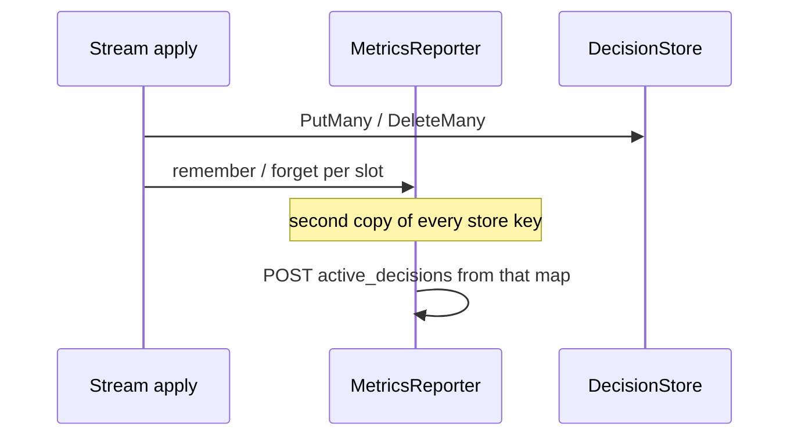

Developer review: in progress — 2026-09-20T17:43:16Z

## What this changes
**Operators.** None.

**Admin users.** None.

**Developers.** Parks Range `active_decisions` forget as `knowledge/debt/2026-09-20-range-active-decisions-forget.md`. The store-owned gauge move is not on this branch yet.

**End users.** None.

## Motivation
Stream and alone modes POST CrowdSec `active_decisions` by keeping a second map of every Ip, header, and Range key on the metrics reporter. Origin is already packed on each DecisionStore slot. At hundreds of thousands of IP decisions that map is a second copy of every store key.

On `master`, `rememberActiveDecision` / `forgetActiveDecision` still sit beside Put/Delete, memory PublishTick expiry never decrements the gauge, and Redis Put/Delete never GET the previous origin. If this PR does not land, large stream sets keep paying that RSS, and expired memory slots stay counted until process restart.

## Merge readiness
Prepare grounded; stub PR open; CI in progress. 1 item remains for this card (the gauge move is later phases).

Priority: P2 — real operator RSS pain at large stream sets, with a workaround of keeping the extra map
Reviewed head: 5b1748ed
Owner decision: None.

## Review scores
| Measure | Result | What it means |
| --- | --- | --- |
| Overall readiness | 3/6 | CI still running; review comments are empty |
| CI proof | 3/6 | in progress — [run 35526746703](https://github.com/david-garcia-garcia/crowdsec-bouncer-traefik-plugin/actions/runs/35526746703) and [run 35526746704](https://github.com/david-garcia-garcia/crowdsec-bouncer-traefik-plugin/actions/runs/35526746704) |
| Local tests proof | N/A | before implement (`localTests: none`); remote CI covers proof |
| Review resolution | 6/6 | no open PR comments |

## Verification
| Check | Result | Evidence |
| --- | --- | --- |
| Branch | 2026-09-20-store-active-decisions-gauge pushed | `git` `origin/2026-09-20-store-active-decisions-gauge` |
| OpenSpec | none | `openspec/` |
| Pull request | https://github.com/david-garcia-garcia/crowdsec-bouncer-traefik-plugin/pull/129 | pr-host List |
| CI | build 35526746703 in progress https://github.com/david-garcia-garcia/crowdsec-bouncer-traefik-plugin/actions/runs/35526746703 | pr-host CI |
| Local tests | none | handoff.yaml localTests |
| PR comments | no comments | comments: none |

## Specs
None.

## Follow-up issues
- [ ] [Range active_decisions forget after dropping the slot map](https://github.com/david-garcia-garcia/crowdsec-bouncer-traefik-plugin/blob/2026-09-20-store-active-decisions-gauge/knowledge/debt/2026-09-20-range-active-decisions-forget.md) — Range is a blob + LPM trees, not a slot Peek; omit Range from the store-owned gauge until ApplyRangeBatch displacements.

## How this fits together
Local ticket `2026-09-20-store-active-decisions-gauge` is on branch `2026-09-20-store-active-decisions-gauge` targeting `master`, stub PR 129, CI in progress.

## Decision needed
None.

## Before merge
- [ ] [P2] Move `active_decisions` group-by onto DecisionStore and drop the reporter slot maps
- [x] Stub PR open against `master`
- [x] Park Range forget debt

## Findings
None.

## Axis review
None.

## Agent review details

### Review metrics
| Metric | Value | Why it matters |
| --- | --- | --- |
| Specs in this PR | none | Same list as ## Specs; do not paste diff --stat |
| Open reviewer comments walked | 0 FIX / 0 ANSWER / 0 open | Unanswered review is merge risk |
| Reviewed head | 5b1748eda083e650401d8df73aa81f59b2e801b4 | Card must match the branch you measured |

### Stored data model
None.

### Technical review
Best possible solution: DecisionStore already holds origin on each slot; counting there drops the second map versus `master`.

Do we have a high-confidence way to reproduce? Yes, dest `pkg/lapi/client_metrics.go` still allocates `activeDecisionSlots` and stream apply still remember/forget around Put/Delete.

Is this the best way to solve the issue? Yes — count at the store mutation instead of a parallel forget index, and omit Range until blob displacements exist.

### Evidence
What I checked:
- Dest `origin/master` `2400d0b0137e018c384d1b72708946d9a9b23afa` has `pkg/decisionstore` and `pkg/lapi/client_metrics.go` (`git ls-tree`)
- Reporter maps and remember/forget (`pkg/lapi/client_metrics.go`, `client_stream.go`, `client_decisions.go`)
- Memory PublishTick expiry does not decrement a gauge (`pkg/decisionstore/memory.go`)
- Redis PutMany/DeleteMany do not GET previous origin (`pkg/decisionstore/redis.go`)
- `Store.Peek` not found; engine is funcs on a struct (`pkg/decisionstore/store.go`)
- Research packet exists (`knowledge/research/ext_crowdsec_lapi_usage-metrics/`); no clone written
- One OPEN PR 129; comment inventory empty
- CI in progress on runs 35526746703 and 35526746704

### Rank-up moves
None.
