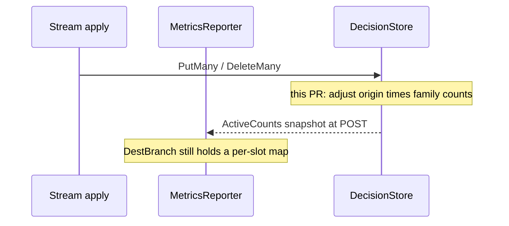

Developer review: in progress — 2026-09-20T18:27:58Z

## What this changes
**Operators.** None.

**Admin users.** None.

**Developers.** DecisionStore owns the stream/alone `active_decisions` group-by (`ActiveCounts`); MetricsReporter drops the per-slot maps and snapshots the store at POST. Range CIDRs stay out of the gauge.

**End users.** None.

## Motivation
Stream and alone modes POST CrowdSec `active_decisions` so `cscli metrics show bouncers` can show how many Ip and header records this connection currently applies. Origin is already packed on each DecisionStore slot (memory `LiveSlot.Word`, Redis `KindOriginString`).

On `master`, `MetricsReporter` still keeps `activeDecisionSlots` plus `activeDecisionsByOriginIPType` — one extra entry per store key — and stream apply remember/forget around Put/Delete. Memory `PublishTick` expiry never decrements that map; Redis Put/Delete never GET the previous origin. At hundreds of thousands of IP decisions that is a second copy of every store key. If this PR does not land, large stream sets keep paying that RSS, and expired memory slots stay counted until process restart.

## Merge readiness
Six-axis review closed (hard findings applied; judgement skipped). Local tests passed; CI still running on head `9b0c56a4`. 1 item remains (wait for CI).

Priority: P2 — real operator RSS pain at large stream sets, with a workaround of keeping the extra map
Reviewed head: 9b0c56a4
Owner decision: Required. See Decision needed.

## Review scores
| Measure | Result | What it means |
| --- | --- | --- |
| Overall readiness | 3/6 | CI still running on the review head |
| CI proof | 3/6 | in progress — [run 35529057487](https://github.com/david-garcia-garcia/crowdsec-bouncer-traefik-plugin/actions/runs/35529057487) and [run 35529057492](https://github.com/david-garcia-garcia/crowdsec-bouncer-traefik-plugin/actions/runs/35529057492) |
| Local tests proof | N/A | `localTests: passed`; remote CI covers proof |
| Review resolution | 6/6 | no open PR comments |

## Verification
| Check | Result | Evidence |
| --- | --- | --- |
| Branch | 2026-09-20-store-active-decisions-gauge pushed | `git` `origin/2026-09-20-store-active-decisions-gauge` |
| OpenSpec | store-owned-active-decisions-gauge | `openspec/changes/store-owned-active-decisions-gauge/` |
| Pull request | https://github.com/david-garcia-garcia/crowdsec-bouncer-traefik-plugin/pull/129 | pr-host List |
| CI | build 35529057487 in progress https://github.com/david-garcia-garcia/crowdsec-bouncer-traefik-plugin/actions/runs/35529057487 | pr-host CI |
| Local tests | passed | handoff.yaml localTests |
| PR comments | no comments | comments: none |

## Specs
- [core_plugin_lapi_usage-metrics](https://github.com/david-garcia-garcia/crowdsec-bouncer-traefik-plugin/blob/2026-09-20-store-active-decisions-gauge/openspec/changes/store-owned-active-decisions-gauge/proposal.md) — modified
- [core_plugin_decisionstore_store](https://github.com/david-garcia-garcia/crowdsec-bouncer-traefik-plugin/blob/2026-09-20-store-active-decisions-gauge/openspec/changes/store-owned-active-decisions-gauge/proposal.md) — modified

## Follow-up issues
- [ ] [Range active_decisions forget after dropping the slot map](https://github.com/david-garcia-garcia/crowdsec-bouncer-traefik-plugin/blob/2026-09-20-store-active-decisions-gauge/knowledge/debt/2026-09-20-range-active-decisions-forget.md) — Range is a blob + LPM trees, not a slot Peek; omit Range from the store-owned gauge until ApplyRangeBatch displacements.

## How this fits together
Local ticket `2026-09-20-store-active-decisions-gauge` is on branch `2026-09-20-store-active-decisions-gauge` targeting `master`, PR 129, code review closed, CI in progress.

## Decision needed
| Question | Decision | By |
| --- | --- | --- |
| Redis TTL expiry — should counts drop when Redis keys expire without DeleteMany? | assumed — no. Dest reporter also never sees Redis TTL. Redis PublishTick stays a no-op. Counts drop on DeleteMany / overwrite only. | explore |

## Before merge
- [x] Move `active_decisions` group-by onto DecisionStore and drop the reporter slot maps
- [x] Park Range forget debt
- [x] Apply hard code-review findings (metrics snapshot comment; `TestOpenDecisionStore_CountActiveFromMode`)
- [ ] [P2] Wait for CI on head `9b0c56a4`

## Findings
None.

## Axis review
[Standards](https://github.com/david-garcia-garcia/crowdsec-bouncer-traefik-plugin/blob/2026-09-20-store-active-decisions-gauge/devstate/2026/09/2026-09-20-store-active-decisions-gauge/codereview_standards.md) — 3 total, 0 pending, 1 completed, 2 skipped
[Spec](https://github.com/david-garcia-garcia/crowdsec-bouncer-traefik-plugin/blob/2026-09-20-store-active-decisions-gauge/devstate/2026/09/2026-09-20-store-active-decisions-gauge/codereview_spec.md) — 0 total, 0 pending, 0 completed
[Security](https://github.com/david-garcia-garcia/crowdsec-bouncer-traefik-plugin/blob/2026-09-20-store-active-decisions-gauge/devstate/2026/09/2026-09-20-store-active-decisions-gauge/codereview_security.md) — 0 total, 0 pending, 0 completed
[Performance](https://github.com/david-garcia-garcia/crowdsec-bouncer-traefik-plugin/blob/2026-09-20-store-active-decisions-gauge/devstate/2026/09/2026-09-20-store-active-decisions-gauge/codereview_performance.md) — 0 total, 0 pending, 0 completed
[Dead](https://github.com/david-garcia-garcia/crowdsec-bouncer-traefik-plugin/blob/2026-09-20-store-active-decisions-gauge/devstate/2026/09/2026-09-20-store-active-decisions-gauge/codereview_dead.md) — 1 total, 0 pending, 0 completed, 1 skipped
[Test coverage](https://github.com/david-garcia-garcia/crowdsec-bouncer-traefik-plugin/blob/2026-09-20-store-active-decisions-gauge/devstate/2026/09/2026-09-20-store-active-decisions-gauge/codereview_coverage.md) — 2 total, 0 pending, 1 completed, 1 skipped

## Agent review details

### Review metrics
| Metric | Value | Why it matters |
| --- | --- | --- |
| Specs in this PR | 0 added / 2 modified | Same list as ## Specs; do not paste diff --stat |
| Open reviewer comments walked | 0 FIX / 0 ANSWER / 0 open | Unanswered review is merge risk |
| Reviewed head | 9b0c56a495a0d2b9e9a0cd92c296456e5b4683fc | Card must match the branch you measured |

### Stored data model
None.

### Technical review
Best possible solution: DecisionStore already holds origin on each slot; counting there drops the second map versus `master`.

Do we have a high-confidence way to reproduce? Yes, dest `pkg/lapi/client_metrics.go` still allocates `activeDecisionSlots` and stream apply still remember/forget around Put/Delete.

Is this the best way to solve the issue? Yes — count at the store mutation instead of a parallel forget index, and omit Range until blob displacements exist.

### Evidence
What I checked:
- Six-axis files under the run root; no `Status: open` remains
- Hard findings applied: metrics snapshot comment; `TestOpenDecisionStore_CountActiveFromMode`
- Judgement skipped: duplicated increment/decrement wrappers; Redis canonicalKeys helper; exported `OriginID`; Redis live no-increment
- CI in progress on runs 35529057487 (Main Process, Race detector success) and 35529057492 (e2e: go+dragonfly success, binary+mock success, docker+pester in progress)

### Rank-up moves
None.
