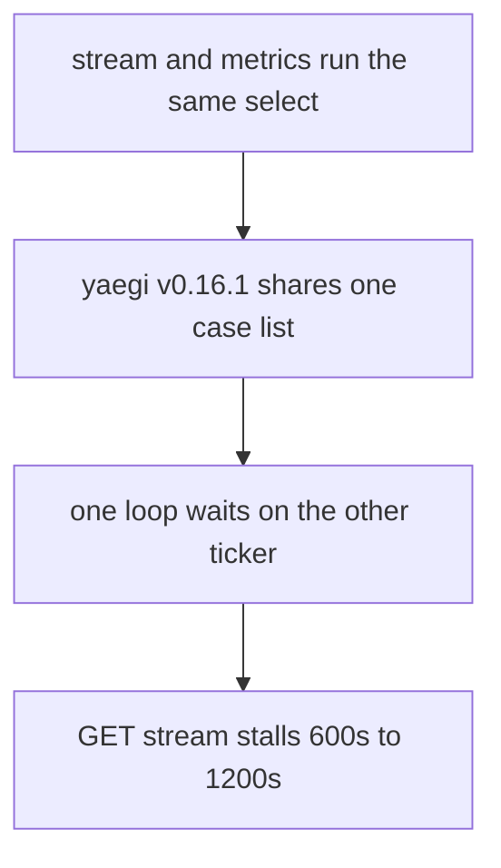

## Motivation
Stream and metrics both enter one helper, `startTicker`. That helper starts a goroutine whose `select` waits on that call’s `ticker.C` and a buffered stop. `work()` runs on that goroutine. Sleep and Close send on both stop channels, then nil the fields. Wake and `startStream` start the loops again.

Traefik loads this plugin under yaegi v0.16.1. That interpreter builds a `select` case list once per statement and shares the slice across every goroutine that runs the statement, so the stream loop can wait on the metrics ticker (or the reverse). Upstream saw `GET /v1/decisions/stream` stall for about one or two metrics intervals while `POST /v1/usage-metrics` continued. Default `LapiMetricsUpdateIntervalSeconds` is `600`, so that stall is about 600s to 1200s. This tree still uses that shared `select`. Native isolation of the same two loops is a false green: the share is yaegi-only, and nothing here proved each loop stayed on its own channel under the interpreter Traefik actually uses.

Left alone, a Traefik deploy can stop refreshing CrowdSec decisions for ten to twenty minutes while still serving. Disabling metrics (`metricsUpdateIntervalSeconds: 0`) avoids the second loop but drops usage-metrics. The cross-wait is uncommon, but it is a live stream freeze, not a docs gap.

Priority: P2 — real operator and end-user pain when stream poll stalls, with a disable-metrics workaround and a rare race

## Implementation
Keep `stopTicker` and the buffered stop. Split the loop into two source functions so each `select` is its own statement and gets its own yaegi case slice: `startStreamTicker` and `startMetricsTicker` create the ticker, spawn `runStreamTicker` / `runMetricsTicker`, and `defer ticker.Stop()`. Those run functions take injectable tick and stop channels; `work()` stays on that goroutine. `New`, `startStream`, and `Wake` call the matching start. Sleep and Close still `stopTicker` then nil. Do not range the ticker without a stop case (`Ticker.Stop` does not close `C`). Proof is a 20_000-send, `GOMAXPROCS>1` drive of the production loops under yaegi via `pkg/yaegitest.Run` (package `lapi` cannot load under `yaegi test`), plus a native test that stop ends both goroutines.

## What this changes
**Operators.** Stream poll under Traefik no longer freezes for one or two metrics intervals (default 600s) while usage-metrics continues; no new deploy key.
**Admin users.** None.
**Developers.** Stream and metrics ticker `select`s must stay distinct statements; `RunStreamTickerForTest` and `RunMetricsTickerForTest` are the exported drivers for that invariant.
**End users.** Requests in front of this middleware no longer ride a CrowdSec decision set that can sit stale for one or two metrics intervals while stream poll waits on the metrics ticker.

## Merge readiness
In progress. 0 items remain.

Priority: P2 — real operator and end-user pain when stream poll stalls, with a disable-metrics workaround and a rare race
Reviewed head: d3529c73
Owner decision: None.

## Review scores
| Measure | Result | What it means |
| --- | --- | --- |
| Overall readiness | 1/6 | Not ready |
| CI proof | 1/6 | not seen |
| Local tests proof | N/A | remote PR — CI proof covers this |
| Review resolution | N/A | no OPEN PR |

## Verification
| Check | Result | Evidence |
| --- | --- | --- |
| Branch | 2026-09-26-yaegi-shared-select pushed | `git` |
| OpenSpec | yaegi-safe-ticker-loop | `openspec/` |
| Pull request | none | pr-host |
| CI | not seen | caller omitted CI snapshot |
| Local tests | passed | handoff.yaml localTests |
| PR comments | no comments | devstate/comments.md |

## Specs
Worktree:
- [core_plugin_lapi_stream-single-flight](https://github.com/david-garcia-garcia/crowdsec-bouncer-traefik-plugin/blob/2026-09-26-yaegi-shared-select/openspec/changes/yaegi-safe-ticker-loop/proposal.md) — modified
- [core_plugin_lapi_usage-metrics](https://github.com/david-garcia-garcia/crowdsec-bouncer-traefik-plugin/blob/2026-09-26-yaegi-shared-select/openspec/changes/yaegi-safe-ticker-loop/proposal.md) — modified

## Deviations from the ask
None.

## Follow-up issues
None.

## How this fits together
Ticket 2026-09-26-yaegi-shared-select on branch 2026-09-26-yaegi-shared-select targeting master; PR no PR yet; CI not seen.

## Explore Decisions
None.

## Findings
None.

## Axis review
[Standards](https://github.com/david-garcia-garcia/crowdsec-bouncer-traefik-plugin/blob/2026-09-26-yaegi-shared-select/devstate/2026/09/2026-09-26-yaegi-shared-select/codereview_standards.md) — 0 total, 0 pending, 0 completed
[Nitpicks](https://github.com/david-garcia-garcia/crowdsec-bouncer-traefik-plugin/blob/2026-09-26-yaegi-shared-select/devstate/2026/09/2026-09-26-yaegi-shared-select/codereview_nitpicks.md) — 0 total, 0 pending, 0 completed
[Spec](https://github.com/david-garcia-garcia/crowdsec-bouncer-traefik-plugin/blob/2026-09-26-yaegi-shared-select/devstate/2026/09/2026-09-26-yaegi-shared-select/codereview_spec.md) — 0 total, 0 pending, 0 completed
[Scope](https://github.com/david-garcia-garcia/crowdsec-bouncer-traefik-plugin/blob/2026-09-26-yaegi-shared-select/devstate/2026/09/2026-09-26-yaegi-shared-select/codereview_scope.md) — 0 total, 0 pending, 0 completed
[Security](https://github.com/david-garcia-garcia/crowdsec-bouncer-traefik-plugin/blob/2026-09-26-yaegi-shared-select/devstate/2026/09/2026-09-26-yaegi-shared-select/codereview_security.md) — 0 total, 0 pending, 0 completed
[Performance](https://github.com/david-garcia-garcia/crowdsec-bouncer-traefik-plugin/blob/2026-09-26-yaegi-shared-select/devstate/2026/09/2026-09-26-yaegi-shared-select/codereview_performance.md) — 0 total, 0 pending, 0 completed
[Dead](https://github.com/david-garcia-garcia/crowdsec-bouncer-traefik-plugin/blob/2026-09-26-yaegi-shared-select/devstate/2026/09/2026-09-26-yaegi-shared-select/codereview_dead.md) — 0 total, 0 pending, 0 completed
[Test coverage](https://github.com/david-garcia-garcia/crowdsec-bouncer-traefik-plugin/blob/2026-09-26-yaegi-shared-select/devstate/2026/09/2026-09-26-yaegi-shared-select/codereview_coverage.md) — 0 total, 0 pending, 0 completed

## Agent review details

### Review metrics
| Metric | Value | Why it matters |
| --- | --- | --- |
| Specs in this PR | 0 added / 2 modified | Same list as ## Specs |
| Open reviewer comments walked | 0 FIX / 0 ANSWER / 0 open | Unanswered review is merge risk |
| Reviewed head | d3529c734b7be0a9806acb121e98dd948a9aae6b | Card must match the branch you measured |

### Stored data model
None.
