# CrowdSec modes

How this plugin fetches decisions and what happens on a request. The README lists a one-line summary of each `LapiMode`; this page is the sequence for each path.

## none

Every request asks LAPI. No decision cache.

> A ban decision exists in CrowdsecLAPI

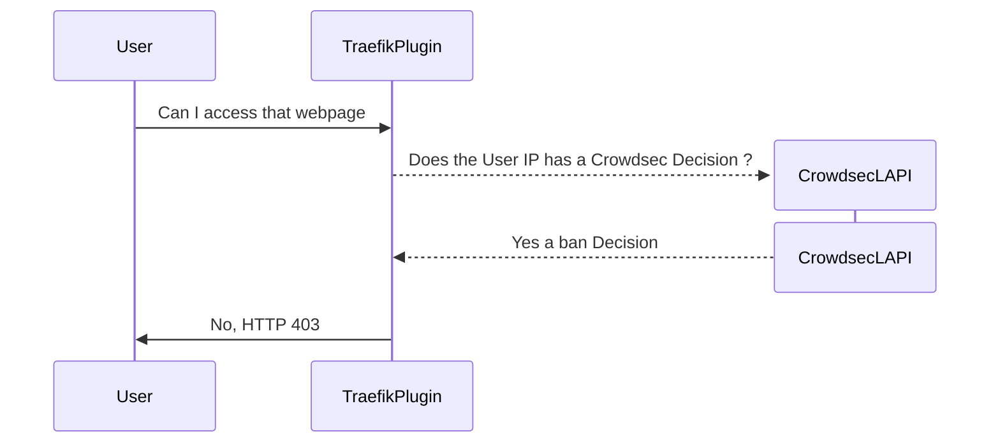

> No decision in CrowdsecLAPI

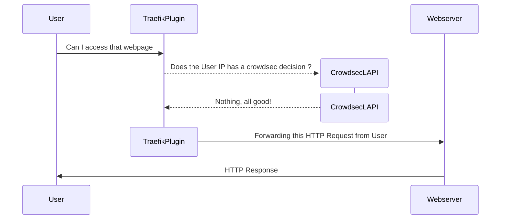

## live

Ask LAPI on a cache miss, then store that IP's result for `BouncerLiveTtlSeconds`.

> A ban decision exists in CrowdsecLAPI but not in cache

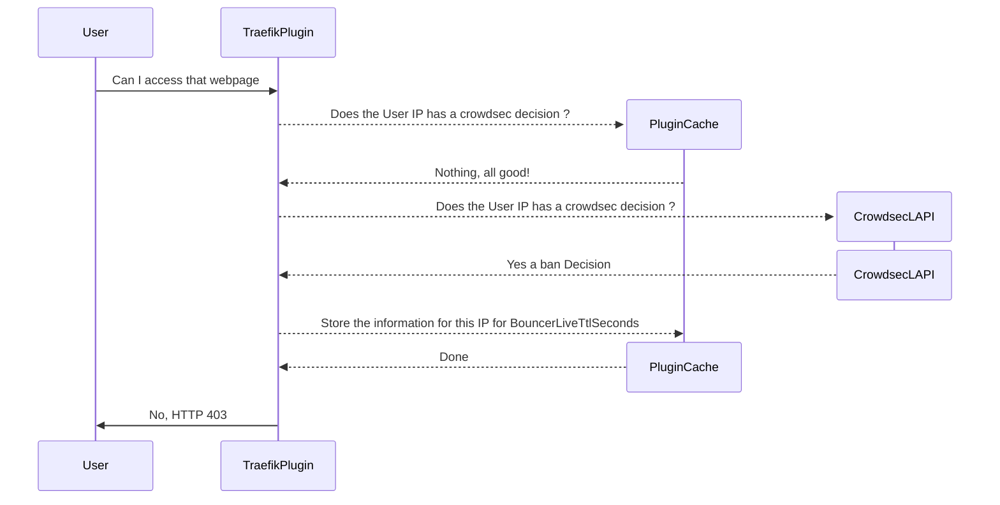

> No decision in cache

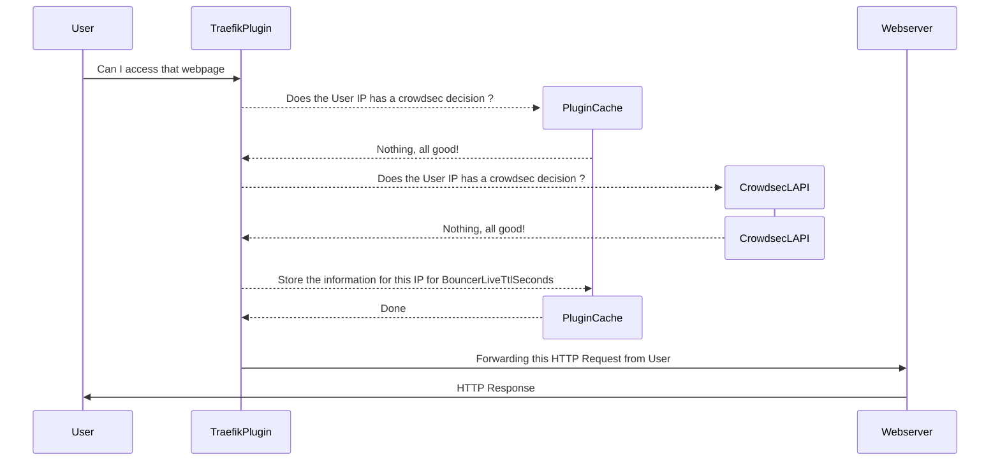

## stream

Sync the decision list from LAPI every `LapiUpdateIntervalSeconds`. The request path hits cache only.

> Cache synchronization every LapiUpdateIntervalSeconds

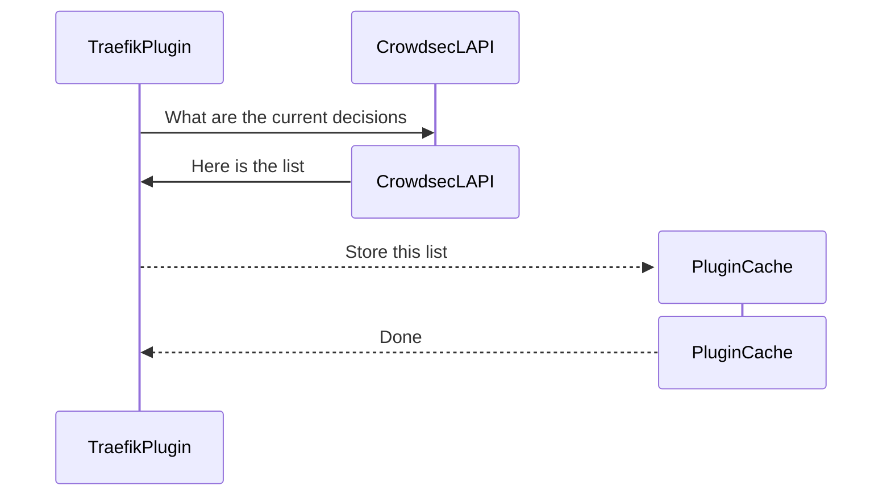

> A ban decision exists in cache

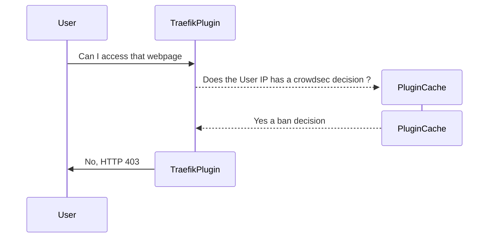

> No decision in cache

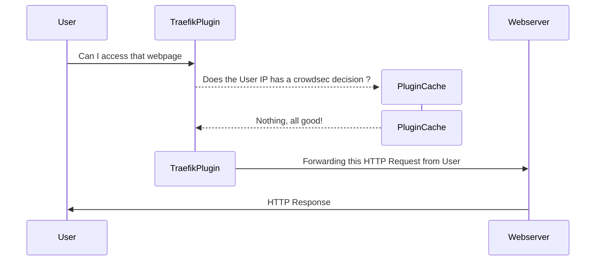

## alone

Like stream, but the list comes from the CrowdSec Central API (CAPI), about every two hours. No local CrowdSec.

> Cache synchronization every 2 hours to the Crowdsec Central API

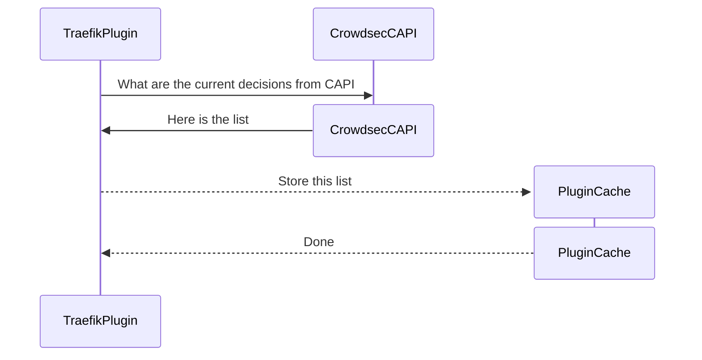

> A ban decision exists in cache

> No decision in cache

## AppSec-only (`lapiEnabled: false`)

Skip IP decisions. Send the HTTP request to CrowdSec AppSec (`appsecEnabled: true`).

> The request is detected as malicious

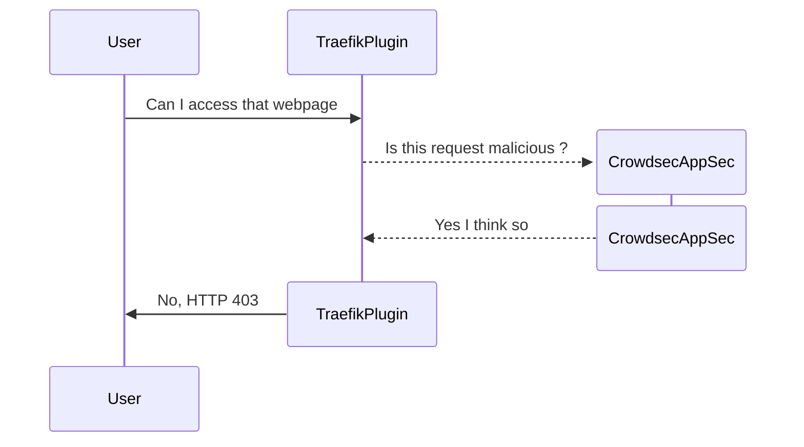

> The request is not detected as malicious

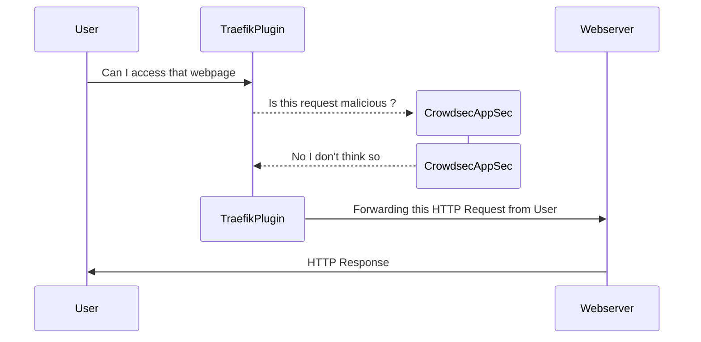

## Captcha

A captcha decision shows a challenge. After the provider accepts it, the IP is clean for `bouncerCaptchaGracePeriodSeconds`.

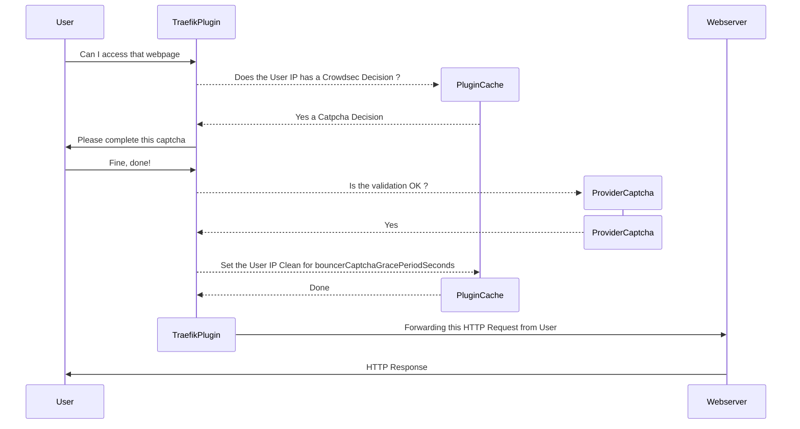
